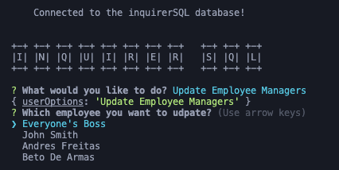

# InquirerSQL

## Description
This is a Content Management System that allow end-users to easily view and interact with information stored in databases. I chose to leverage the power of <code>inquirer</code> to create a great end-user customer experience.

## Table of Contents
- [Prerequisites](#prerequisites)
- [Installation](#installation)
- [Usage](#usage)
- [Credits](#credits)
- [License](#license)

## Prerequisites
* Since this is a node.js app, you will need to install node.js in your laptop.  
    * Download the latest version of node.js here --> https://nodejs.org/en/download/  
* After node.js has been installed on your machine, you will need to install npm.  
    * Follow the steps in the following website to install npm --> https://docs.npmjs.com/cli/v9/commands/npm-install?v=true  
* You will also need to have installed mySQL. 
    * Follow the steps in the following website to install npm --> https://www.mysql.com/
* If you would like to install the schema and seeds dev. You will need to open <code>mysql</code> and run the following two files
    * <code>schema.sql</code>
    * <code>seeds.sql</code> 
* Configure your SQL connection 

This is an inclusive list of the packages that will be installed when you run npm.
* console.table
* dotenv
* inquirer
* mysql2
* sequelize (not currently in use, but I intend to use it in the future for updates)

Once those two prerequisites have been installed on your laptop proceed to the Installation steps

## Installation
1) Clone or download the ZIP to your local repository
2) Open a CLI terminal
3) Navigate to your <code>inquirerSQL/Develop</code> folder 
4) Run the following command to install the necessary npm packages:
    <pre>npm i</pre>
4) Start the application by running the <code>inquirer.js</code> with the following command:
    <pre>node inquirer.js</pre>
6) Start using your Content Management System Locally!

## Usage 
This code can be used as an starting point for developers who need to create a Content Management system to allow end-users to Create, read, update, delete databases

## Credits
* Me
* Myself
* I

Alberto De Armas --> https://github.com/nosbeto

## License

MIT License

Copyright (c) [2023] [Alberto De Armas]

Permission is hereby granted, free of charge, to any person obtaining a copy
of this software and associated documentation files (the "Software"), to deal
in the Software without restriction, including without limitation the rights
to use, copy, modify, merge, publish, distribute, sublicense, and/or sell
copies of the Software, and to permit persons to whom the Software is
furnished to do so, subject to the following conditions:

The above copyright notice and this permission notice shall be included in all
copies or substantial portions of the Software.

THE SOFTWARE IS PROVIDED "AS IS", WITHOUT WARRANTY OF ANY KIND, EXPRESS OR
IMPLIED, INCLUDING BUT NOT LIMITED TO THE WARRANTIES OF MERCHANTABILITY,
FITNESS FOR A PARTICULAR PURPOSE AND NONINFRINGEMENT. IN NO EVENT SHALL THE
AUTHORS OR COPYRIGHT HOLDERS BE LIABLE FOR ANY CLAIM, DAMAGES OR OTHER
LIABILITY, WHETHER IN AN ACTION OF CONTRACT, TORT OR OTHERWISE, ARISING FROM,
OUT OF OR IN CONNECTION WITH THE SOFTWARE OR THE USE OR OTHER DEALINGS IN THE
SOFTWARE.
